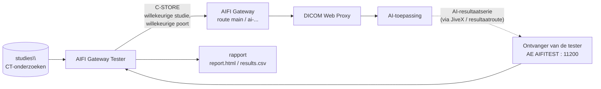

# AIFI Gateway Tester — handleiding

Testprogramma voor de AIFI Anonymization Gateway. Het pakt willekeurig CT-onderzoeken uit
een map, stuurt ze naar één van de poorten (routes) van de gateway, wacht tot de AI-resultaatserie
terugkomt en maakt daar een testrapport van. Dat kan in bursts (veel studies tegelijk) en
op vaste tijden (bijvoorbeeld elke 5 minuten), ook naast elkaar.



## 1. Hoe een test werkt

1. Een schema (of een handmatige burst) kiest een willekeurige studie uit `studies\` en een
   willekeurige poort uit `targets` (naar verhouding van `weight`), of een vaste poort.
2. **Unieke studie per test** (`studies.uniquify: true`): elke verzending krijgt nieuwe
   Study/Series/SOP Instance UID's (verwijzingen daarnaar worden meegenomen) en een nieuw
   AccessionNumber `AIFIT` + 8 cijfers. Zo is elke test voor JiveX, de gateway en de AI een
   nieuwe studie, en is elk resultaat aan precies één test te koppelen. Patiëntgegevens in de
   bestanden blijven zoals ze zijn: gebruik dus testpatiënten of reeds geanonimiseerde data.
3. De studie gaat over één associatie naar de gateway. Weigert de gateway beelden of is de
   poort onbereikbaar, dan is de uitkomst **verzenden mislukt**.
4. De tester luistert zelf op `receiver` (standaard AE `AIFITEST`, poort `11200`). Een
   ontvangen object hoort bij een test als de **StudyInstanceUID** of het **AccessionNumber**
   gelijk is aan wat verstuurd is, of (met `jivexDatabase`) de **gepseudonimiseerde
   StudyInstanceUID** uit JiveX. Het telt als AI-resultaat als het in een **nieuwe serie**
   zit (niet een van de verstuurde series) en voldoet aan `resultModalities` /
   `resultSeriesDescriptionContains`.
5. Na het eerste resultaatbeeld wacht de tester `settleSeconds` op de rest van de serie; dan is
   de test **geslaagd**. Komt er binnen `resultTimeoutMinutes` niets terug: **geen resultaat**.

**Voorwaarde:** de AI-resultaten moeten naar de tester worden gestuurd. Stel in JiveX / de
resultaatroute van de AI-toepassing de AE-titel en poort van de tester in als bestemming
(voor de testperiode). Zet ook `AIFITEST` in `allowedCallingAeTitles` van elke gatewayroute
die getest wordt.

## 2. Installatie

1. Java 11 of nieuwer. Pak `aifi-gateway-tester-dist_<versie>.zip` uit, bv. naar
   `C:\aifi-gateway-tester\`.
2. Zet test-CT-onderzoeken in `studies\` (elke mapindeling; niet-DICOM-bestanden worden
   overgeslagen).
3. Start `aifi-gateway-tester.bat` → **[1]**. De eerste keer wordt `tester.yaml` aangemaakt;
   vul die in (§3) en kies opnieuw **[1]**: je ziet de gevonden studies (alleen een korte
   referentie, modaliteit, aantal beelden en grootte).
4. **[2]** test met C-ECHO of alle gatewaypoorten bereikbaar zijn.
5. Open in de firewall de ontvangstpoort van de tester (11200) voor de AI-/JiveX-server.

## 3. Instellingen (`tester.yaml`)

```yaml
targets:                       # de gatewaypoorten (routes) waarnaar gestuurd wordt
  - name: main
    host: 10.8.0.5
    port: 11112
    aeTitle: AIFIGW
    callingAeTitle: AIFITEST
    weight: 2                  # krijgt 2x zoveel studies als een poort met weight 1
  - name: ai-thorax
    host: 10.8.0.5
    port: 11113
    aeTitle: AIFI_THORAX
    weight: 1

schedules:                     # meerdere schema's lopen naast elkaar
  - name: elke-5-min
    everyMinutes: 5
    count: 1                   # 1 studie per keer
  - name: burst-per-uur
    everyMinutes: 60
    count: 10                  # burst van 10 studies
    startAfterMinutes: 2
  - name: thorax-burst
    everyMinutes: 120
    count: 5
    target: ai-thorax          # alleen naar deze poort

run:
  durationHours: 24            # 0 = tot Ctrl+C
  parallelSends: 4             # zoveel associaties tegelijk tijdens een burst
```

| Instelling | Betekenis |
|---|---|
| `studies.modalities` | alleen deze modaliteiten gebruiken (standaard `[CT]`) |
| `receiver` | AE-titel/poort waarop de AI-resultaten binnenkomen; `saveFiles: true` bewaart ze in de sessiemap |
| `matching.resultTimeoutMinutes` | na zoveel minuten zonder resultaat is de test mislukt |
| `matching.settleSeconds` | na het eerste resultaatbeeld zoveel seconden wachten op de rest |
| `matching.resultModalities` | alleen deze modaliteiten tellen als resultaat, bv. `[SR, SEG]` |
| `jivexDatabase` | optioneel: resultaten die met het JiveX-pseudoniem terugkomen toch koppelen (alleen-lezen account) |
| `targets[].tls` / `receiver.tls` | DICOM TLS, als de gatewayroute TLS vereist |

## 4. Gebruik

| Menu / commando | Doel |
|---|---|
| **[1]** `scan` | studies in de map tonen |
| **[2]** `echo` | C-ECHO naar elke gatewaypoort |
| **[3]** `burst <n> [--target <naam>]` | nu *n* studies sturen en wachten op alle resultaten (max. time-out); daarna eindrapport |
| **[4]** `run` | de schema's uitvoeren, gedurende `run.durationHours` of tot Ctrl+C |
| **[5]** | het nieuwste rapport openen |

Elke sessie krijgt een eigen map `reports\<datum-tijd>\`:

- `report.html` — ververst zichzelf elke `refreshSeconds` tijdens de test. Bevat: totalen en
  slagingspercentage, mediaan/P90 van de tijd tot het AI-resultaat, een tijdlijn (per test
  verzendmoment tegen wachttijd; rood = geen resultaat), cijfers per poort en per schema,
  alle tests, en objecten die bij geen test hoorden.
- `results.csv` — één regel per test, voor Excel (scheidingsteken `;`).
- `results.json` — hetzelfde, machineleesbaar.
- `tester.log` — logboek van de sessie.

Bij stoppen (Ctrl+C of einde van `durationHours`) wordt het eindrapport geschreven; tests
die nog wachtten krijgen de uitkomst **niet afgewacht**.

## 5. Uitkomsten

| Uitkomst | Betekenis | Waar zoeken |
|---|---|---|
| geslaagd | AI-resultaat binnen de time-out | — |
| geen resultaat | niets teruggekomen binnen `resultTimeoutMinutes` | gateway: `aifi-gateway status` en `logs\gateway.0.log` (zoek op de tijd); proxy; AI; resultaatroute naar de tester |
| verzenden mislukt | gateway onbereikbaar of beelden geweigerd | `echo`; AE-titel `AIFITEST` in `allowedCallingAeTitles`; gateway-log (bijv. schijf vol) |
| niet afgewacht | sessie gestopt voordat er iets terugkwam | — |

"Ontvangen zonder bijbehorende test" in het rapport betekent dat er iets binnenkwam dat niet
te koppelen was: meestal komt het resultaat terug met de gepseudonimiseerde StudyInstanceUID
en zonder AccessionNumber. Zet dan `jivexDatabase.enabled: true`.

## 6. Privacy

Het rapport en de log bevatten geen patiëntgegevens: een studie heet daar alleen naar een
korte hash (`studyRef`), en de originele UID's, PatientID en naam worden niet getoond.
Ontvangen resultaatbestanden worden alleen opgeslagen met `receiver.saveFiles: true`.
